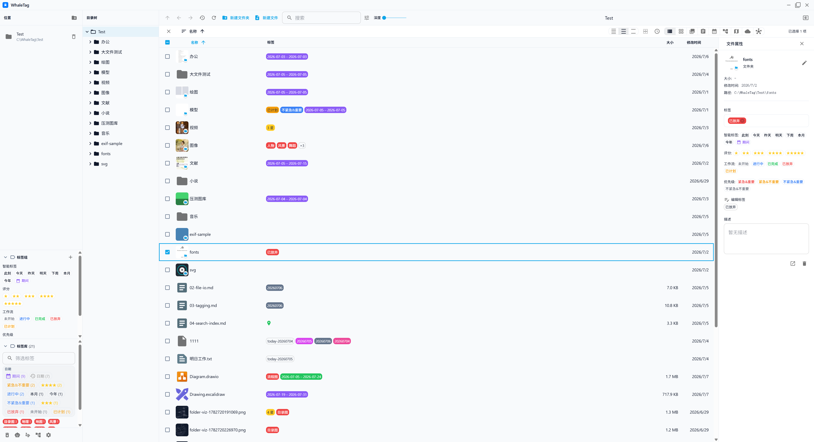
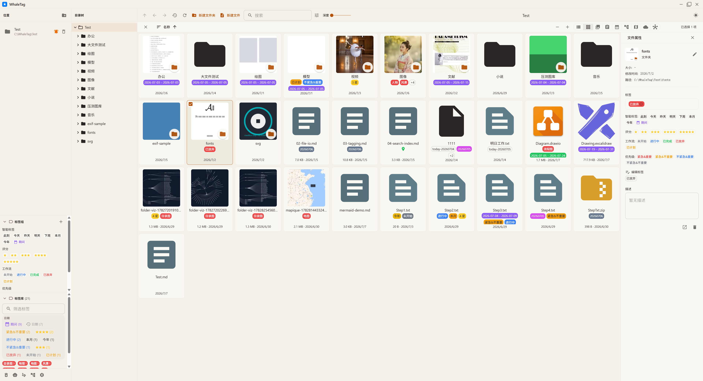
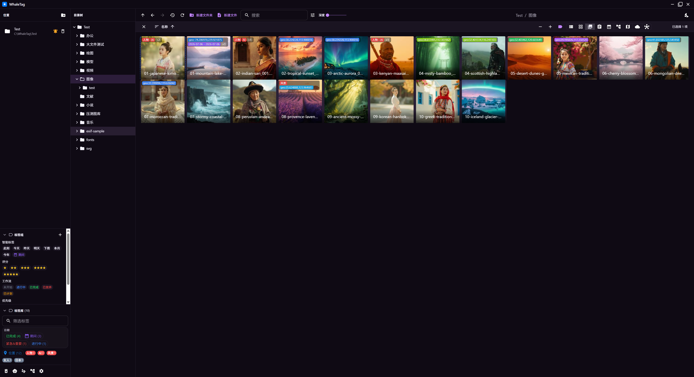
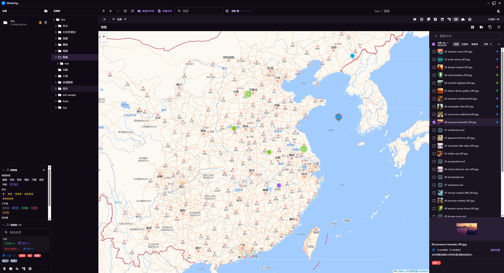
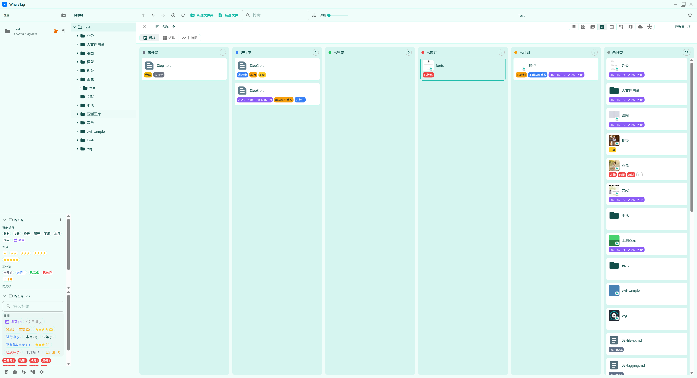
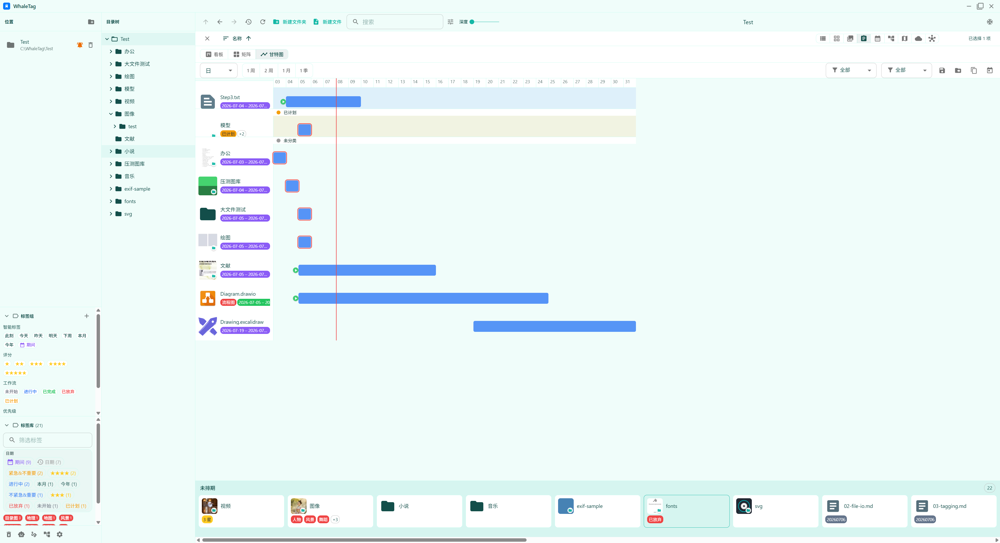
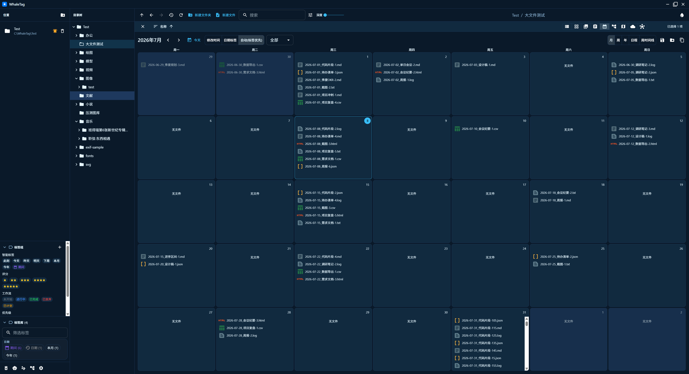
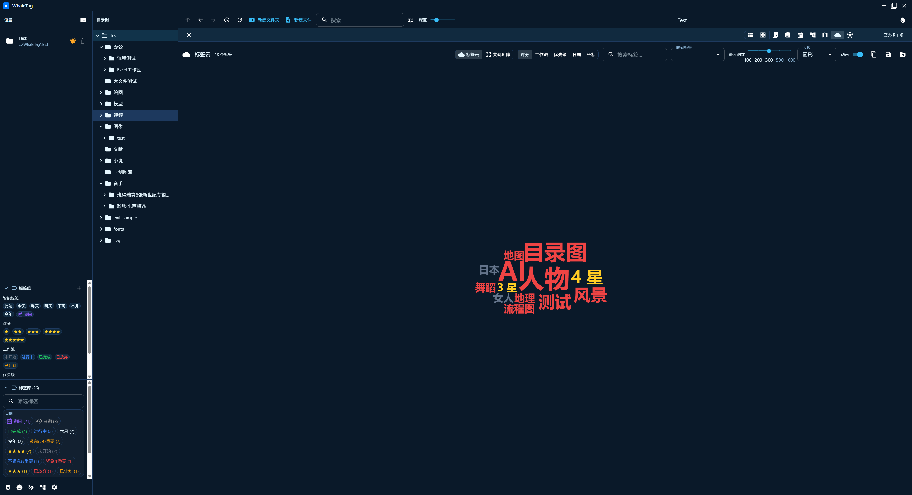
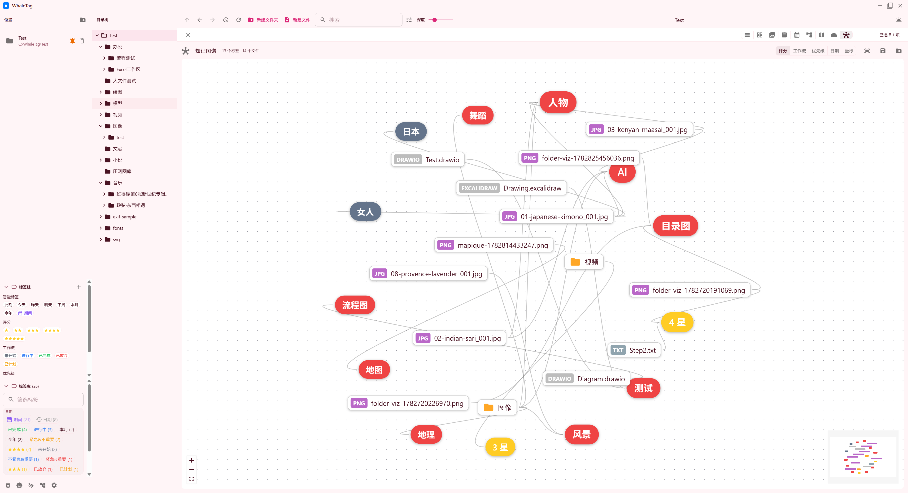
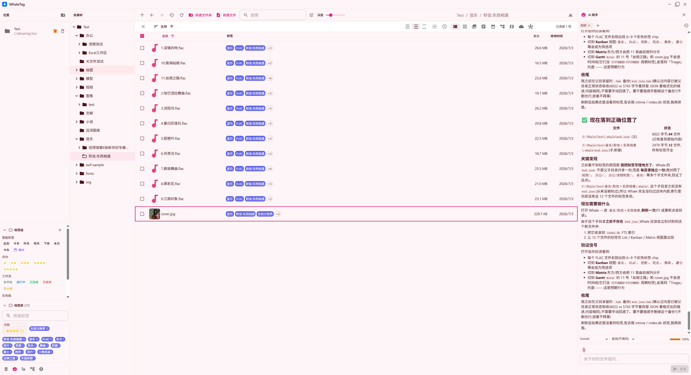

<p align="center">
  
</p>

<h1 align="center">WhaleTag / 鲸鱼标签 🐳</h1>

<p align="center">
  A local-first, offline, privacy-respecting desktop app for managing files and tagging them.<br/>
  本地优先、离线、隐私安全的文件管理与打标签桌面应用。<br/>
  Built on Electron + React + TypeScript (Electron React Boilerplate pattern). MIT licensed, all features free.
</p>

<p align="center">
  <b>English</b> · <a href="#-中文">中文</a>
</p>

---

## 📸 Screenshots

<!-- 占位:请把截图放到 docs/screenshots/ 下,文件名与下方一致即可自动显示。
     Placeholders — drop your images into docs/screenshots/ with the matching filenames. -->

<table>
  <tr>
    <td width="50%" align="center"><br/><sub>主界面 · Main file browser</sub></td>
    <td width="50%" align="center"><br/><sub>网格视角 · Grid</sub></td>
  </tr>
  <tr>
    <td width="50%" align="center"><br/><sub>画廊视角 · Gallery</sub></td>
    <td width="50%" align="center"><br/><sub>地图视角 · Mapique</sub></td>
  </tr>
  <tr>
    <td width="50%" align="center"><br/><sub>看板视角 · Kanban (Task)</sub></td>
    <td width="50%" align="center"><br/><sub>甘特图视角 · Gantt (Task)</sub></td>
  </tr>
  <tr>
    <td width="50%" align="center"><br/><sub>日历视角 · Calendar</sub></td>
    <td width="50%" align="center"><br/><sub>标签云视角 · Tag cloud</sub></td>
  </tr>
  <tr>
    <td width="50%" align="center"><br/><sub>知识图谱视角 · Knowledge graph</sub></td>
    <td width="50%" align="center"><br/><sub>AI 助手 · AI assistant</sub></td>
  </tr>
</table>

---

## English

**WhaleTag** is a local-first, offline, privacy-respecting file manager and tagging
tool. It is built from scratch with the same architecture pattern as TagSpaces
(Electron React Boilerplate) — an independent, clean scaffold with **no code shared
with TagSpaces**.

All data lives on your machine: no backend, no telemetry, no forced cloud. Metadata
(tags, perspectives, colors) is stored in a portable `.whale/` sidecar folder
alongside your files — **filenames and folder structure are never modified**, so the
whole library stays movable.

### Highlights

| Area | What it does |
|------|--------------|
| Locations | Local folder locations + read-only flags + LRU recent access |
| Browsing | Directory tree + breadcrumb + virtual scroll (list / grid / gallery), all 9 perspectives gated by a global `viewDepth` |
| Perspectives | list / grid / gallery / **task** (Kanban + Matrix + **Gantt**) / calendar (5 levels) / mapique / folderviz / tagcloud / knowledge-graph |
| Tagging | `wsd.json` aggregate sidecar; mutex families (rating 1–5 / workflow / quadrant / smart date ×7 / period); inline editor; 3-tier color fallback |
| Search | SQLite FTS5 over filenames + tags (trigram) + fulltext; advanced `SearchQuery` (10 fields); saved searches |
| Thumbnails | image / svg / video / pdf / office / ebook / font (7 kinds) + folder thumbnails; 39 fallback icons |
| Themes | **11 themes** (3 classic + 8 curated); `'system'` is always resolved before reaching MUI |
| Extensions | **17 built-in** viewers/editors; revision history; Open With; archive-viewer decodes 9 formats; cad-viewer 4 tiers |
| AI assistant | Embedded Claude Code CLI + HTTP provider (ollama / openai); streaming sidebar; read-only guardrails; safeStorage keys |

### Tech stack

| Layer | Technology |
|-------|------------|
| Desktop shell | **Electron** 42 |
| UI framework | **React** 18 |
| Language | **TypeScript** 5.9 (`jsx: react-jsx`, `module: CommonJS`) |
| UI components | **MUI** 9 + Emotion |
| State | **Redux** + react-redux + redux-thunk (plain reducers, no Toolkit) |
| Persistence | **redux-persist** (synced through main-process IPC) |
| i18n | **i18next** + react-i18next (`common` namespace, en + zh) |
| Search index | **SQLite FTS5** (per-location `index.db`) |
| Build | **Webpack** 5 + ts-loader, multi-target via `webpack-merge` |
| Packaging | **electron-builder** |

### Architecture (ERB three-process model)

```
WhaleTag/
├── .erb/configs/              # Webpack configs (base + main + renderer, dev & prod)
├── resources/builder.json     # electron-builder config (target = release/app)
├── release/
│   ├── app/                   # the Electron app package electron-builder packs
│   │   └── package.json       #   productName + main = ./dist/main/main.js
│   └── build/                 # installer output (git-ignored)
└── src/
    ├── shared/                # pure logic shared across main ↔ renderer (types + pure fns)
    ├── main/                  # MAIN process — all FS IO, thumbnails, index, extensions, AI CLI
    │   ├── main.ts / preload.ts / ipc.ts / menu.ts
    └── renderer/              # RENDERER process (React UI, web target)
```

**Security model**: `contextIsolation: true`, `nodeIntegration: false`,
`sandbox: true`. The renderer only ever reaches the system through a curated
`window.whale` bridge exposed by preload; all file IO lives in the main process and
goes through `assertWithinAllowedRoot`. See [docs/13-security.md](docs/13-security.md).

### Prerequisites

- **Node.js** ≥ 18
- **npm**

### Install

```bash
cd WhaleTag
npm install
```

> The first install also downloads the Electron binary (large).

### Run in development (hot reload)

```bash
npm run dev
```

This builds the main process once, watches it (`electronmon` auto-restarts Electron),
serves the renderer on `http://localhost:4002`, and launches Electron at the dev
server. The renderer reloads on every save; main-process changes restart Electron.

> Dev-launch hard requirement: ensure `ELECTRON_RUN_AS_NODE` is **unset** in your
> shell — a leftover value makes Electron degrade to a plain Node process and the
> main process won't start. See [docs/09-known-issues.md](docs/09-known-issues.md).

### Build for production

```bash
npm run build      # build main + renderer into release/app/dist
npm start          # run the production build
```

### Package an installer

```bash
npm run package        # current platform
npm run package:win    # Windows (nsis)
npm run package:mac    # macOS (dmg)
npm run package:linux  # Linux (AppImage)
```

Output lands in `release/build/`.

> **Optional runtime tooling** (for office / CAD thumbnails): LibreOffice and
> ODAFileConverter are needed at runtime. They are **not** committed — download them
> yourself and place the installers in `tools/`. See
> [docs/14-packaging.md](docs/14-packaging.md).

### Scripts

| Script | What it does |
|--------|--------------|
| `npm run dev` | Dev mode (main watch + renderer dev server + Electron) |
| `npm run build` | Production build (main + renderer) |
| `npm start` | Run the production build |
| `npm run package` | Build + electron-builder installer |
| `npm run lint` | ESLint |
| `npm run type-check` | `tsc --noEmit` |
| `npm run clean` | Remove build output |

### Documentation

The `docs/` folder describes **current code behavior** per module (not changelogs).
Start at [plan.md](plan.md) — it is the entry index into `docs/01-*.md` … `docs/14-*.md`.

### License

MIT. Third-party notices (e.g. bundled FFmpeg under GPL-3.0) live in [LICENSES/](LICENSES/).

---

## 🐳 中文

**WhaleTag** 是一个本地优先、离线、隐私安全的文件管理与打标签桌面应用。采用与
TagSpaces 相同的架构模式(Electron React Boilerplate)从零自建,**与 TagSpaces 无任何代码共用**。

所有数据都在本地:无后端、无遥测、无强制云。元数据(标签、视角、颜色)以可移植的
`.whale/` sidecar 目录形式与文件放在一起——**不改动文件名、不改变文件夹结构**,整个库
可以整体迁移。

### 核心能力

| 域 | 实现 |
|---|---|
| 位置管理 | 本地文件夹位置 + 只读标记 + LRU 最近访问;云存储(S3/WebDAV)不在范围 |
| 浏览 | 目录树 + 面包屑 + 虚拟滚动(list / grid / gallery),9 视角受全局 `viewDepth` 控制 |
| 视角 | list / grid / gallery / **task**(Kanban + Matrix + **Gantt**)/ calendar(5 档)/ mapique / folderviz / tagcloud / knowledge-graph |
| 标签 | `wsd.json` 聚合 sidecar;互斥家族(评分 1–5 / workflow / quadrant / smart date 7 种 / period);InlineTagInput 编辑;颜色三级回退 |
| 搜索 | SQLite FTS5 文件名 + 标签(trigram)+ 全文;高级查询 `SearchQuery` 10 字段;保存搜索 |
| 缩略图 | image / svg / video / pdf / office / ebook / font(7 种)+ 文件夹缩略图;39 类回退图标 |
| 主题 | **11 种**(3 经典 + 8 策划);`'system'` 必须先解析再流入 MUI |
| 扩展 | **17 个内置**(viewer / editor);修订历史;右键 Open With;archive-viewer 解码 9 种;cad-viewer 4 tier |
| AI 助手 | 嵌入 Claude Code CLI + HTTP provider(`ollama` / `openai`);流式侧栏;只读护栏;safeStorage 存 key |

### 技术栈

| 层 | 技术 |
|---|---|
| 桌面外壳 | **Electron** 42 |
| UI 框架 | **React** 18 |
| 语言 | **TypeScript** 5.9(`jsx: react-jsx`、`module: CommonJS`)|
| UI 组件 | **MUI** 9 + Emotion |
| 状态 | **Redux** + react-redux + redux-thunk(纯 reducer,无 Toolkit)|
| 持久化 | **redux-persist**(走主进程同步 IPC)|
| 国际化 | **i18next** + react-i18next(`common` namespace,en + zh)|
| 搜索索引 | **SQLite FTS5**(每个位置一个 `index.db`)|
| 构建 | **Webpack** 5 + ts-loader,`webpack-merge` 多目标 |
| 打包 | **electron-builder** |

### 安全模型

`contextIsolation: true`、`nodeIntegration: false`、`sandbox: true`。渲染层只通过 preload
暴露的 `window.whale` 桥接触系统能力;所有文件 IO 在主进程,统一走 `assertWithinAllowedRoot`。
详见 [docs/13-security.md](docs/13-security.md)。

### 前置要求

- **Node.js** ≥ 18
- **npm**

### 安装

```bash
cd WhaleTag
npm install
```

> 首次安装会下载 Electron 二进制(体积较大)。

### 开发模式(热重载)

```bash
npm run dev
```

这会:构建一次主进程 → watch 主进程(`electronmon` 自动重启 Electron)→ 在
`http://localhost:4002` 启动渲染层 dev server → 启动 Electron 指向 dev server。
渲染层每次保存即热重载;主进程改动会重启 Electron。

> dev 启动硬约束:务必确保 shell 里 **`ELECTRON_RUN_AS_NODE` 已 unset**——残留值会让
> Electron 退化成纯 Node,主进程不启动。详见 [docs/09-known-issues.md](docs/09-known-issues.md)。

### 生产构建

```bash
npm run build      # 构建主进程 + 渲染层到 release/app/dist
npm start          # 运行生产构建
```

### 打包安装器

```bash
npm run package        # 当前平台
npm run package:win    # Windows (nsis)
npm run package:mac    # macOS (dmg)
npm run package:linux  # Linux (AppImage)
```

输出在 `release/build/`。

> **可选运行时工具**(office / CAD 缩略图需要):运行时需要 LibreOffice 和
> ODAFileConverter。它们**不进 git**——请自行下载并放到 `tools/` 目录。详见
> [docs/14-packaging.md](docs/14-packaging.md)。

### 文档

`docs/` 下按模块描述**当前代码行为**(不是变更记录)。入口是 [plan.md](plan.md),
它索引了 `docs/01-*.md` … `docs/14-*.md` 各模块文档。

### 许可证

MIT。第三方声明(如内置的 FFmpeg,GPL-3.0)在 [LICENSES/](LICENSES/)。
